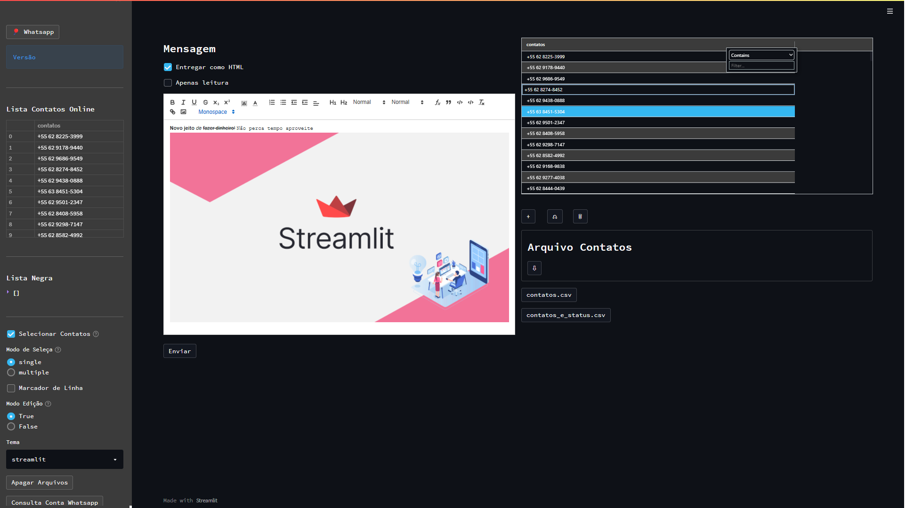

<h2 align="center">
  
  
  <br/>
  <b>Whatsapper</b>
  <p>Aplicativo para automatizar Whatsapp</p>
</h2>

## What it is

- Visual app to send message automatically with whatsapp.

## Dependencies

- **PIP Install**
  - Python
  - Selenium
  - Chromedriver
  - Streamlit
  - Regular Expression

## How to play

- Case you don't have the necessary libraries

`pip install requirements.txt`

```bash
git clone https://github.com/jvcss/whatsapper.git

cd whatsapper

streamlit run app.py
```

##  Log

- Cria **contatos.csv** automático a partir da lista de **contatos** e **conversas**

- Verificação automática das palavras chave **sair** para inclusão na lista de contatos bloqueados antes de enviar a mensagem

- Permite atualizar a base de contatos retirando os que foram excluídos após execução

- Executável `Windows` e `Linux`

- Windows permite envio de imagem e textos com edição

- Linux não permite adicionar imagem na mensagem

- Chrome precisa de uma versão do driver compatível com o seu navegador [Baixar](https://chromedriver.chromium.org/downloads)


